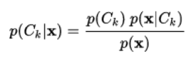
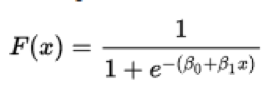
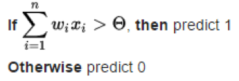
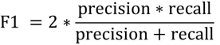
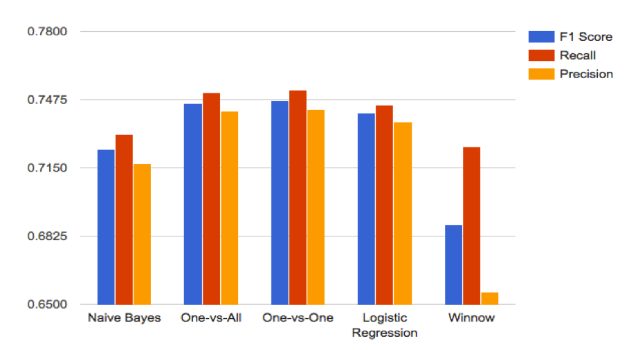
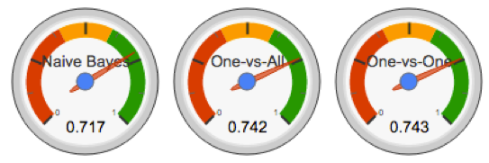

**1. Introduction**

A variety of useful inferences can be made from user interactions on microblogging websites including opinions on variety of topics that are trending, current issues and major stories in the news, reviews on products, predictions and information on popular events, etc. By using twitter as our social media platform of choice, we are able to provide real-time assessment of the public&#39;s sentiment, jubilation, and uncertainty. Several attempts have been made to determine polarity of tweets and classify them into different emotions using various techniques. Using the trained classifiers, our objective is to label the various emotions of the tweets into the following three categories of sentiment:

&#39;4&#39; - Positive, happy, jovial, etc.

&#39;2&#39; - Neutral, okay, don&#39;t care, &quot;meh&quot;, etc.

&#39;0&#39; - Negative, anger, fear, hate, etc.

We decided to use MeTA to accomplish our goal due to our general familiarity of it through other projects. Our goal is to employ some of the techniques and knowledge gathered from the course to achieve the best possible results.

**2. Related Work**

Alec Go, Richa Bhayani, and Lei Huang, _Twitter Sentiment Classification using Distant Supervision_.  This paper focused on using twitter emoticons (using ASCII characters to express human emotions) as indication for positive or negative sentiment.  For example, character &quot;:)&quot; denotes a positive sentiment while &quot;:(&quot; denotes a negative sentiment.  Using what the authors coined as &quot;distant supervision,&quot; this methodology mined tweets with emoticons to train the classifiers.  The authors trained Naive-Bayes, Maximum Entropy (MaxEnt), and Support Vector Machines (SVM) classifiers and achieved an accuracy above 80%.

Apoorv Agarwal, Boyi Xie, Ilia Vovsha, Owen Rambow, Rebecca Passonneau, _Sentiment Analysis of Twitter Data_.  A general discussion on author&#39;s&#39; general approach to twitter sentiment analysis using various language models, using emoticons, and multiple polarities that are prevalent in other sentiment/opinion/topic mining applications.  The authors concluded that &quot;sentiment analysis for Twitter data is not that different from sentiment analysis for other genres.&quot;

Delenn Chin, Anna Zappone, Dessica Zhao, _Analyzing Twitter Sentiment of the 2016 Presidential Candidates_.  Here, the authors analyzed tweets pertaining to 2016 presidential candidates to predict public sentiment toward each candidate.  Furthermore, the author extrapolated based on two polarities, using subsequent emoticons, to cover a range of emotions - happy, sad, fear, laughter, and anger.  The authors used Naive-Bayes, SVM, and K Nearest Neighbors (KNN) classifiers and achieved accuracies in the 50% range.

**3. Relevance**

The work by Go, et al., and Chin, et al., formed the basis for our project.  Both works dealt with sentiment analysis of twitter feeds and further use emoticons to further extract an additional dimension of &quot;meaning.&quot;  In the case of Go, the methodology involved using emoticons to train classifiers.  In Go, the authors using emoticon as positive or negative to train tweets, whereas in Chin, the authors used emoticons to further extract emotion/intuition.  We used their work mostly as a guideline to perform sentiment analysis - we mostly mirrored their approach to training and testing tweets.  Our underlying code was based on what we had used in class - MeTA.  And we trained the classifiers with varying degrees of training set data to see how accuracy varied.

The work by Go, et al. and Chin, et al. are certainly impressive in their own rights.  However, the current suite of tools available for twitter sentiment analysis is difficult to understand and use, it is opaque, and not very conducive to learning or bulk processing.  We want to create a web interface with MeTA being the underlying code, where a user can upload one tweet or a batch of tweets into the GUI, and output the sentiment analysis along with relevant statistics.  The user has the option to use any one of the classifiers we developed for this project.  Or in the alternative, the user has the option to train their own chosen classifier and run their own tests.  Ultimately, we want to take the &quot;coding&quot; away to make this technology more accessible to people of all ages, and education background.

**4. Types of Classifiers**

We wanted to use as many classifiers as MeTA had to compare and contrast the performance of each classifier with a given dataset.  However, we were not able to get every classifier to work.  Out out the long list of built-in MeTA classifiers, we were able get Naive-Bayes, Logistic Regression, Winnow, One-vs-All, and One-vs-One to work. The classifiers we used in this project are briefly discussed below.

**Naive-Bayes (Generative)**

A machine learning algorithm based on a probabilistic model applying Bayes&#39; theorem.  One advantage of this classifier is that it is highly scalable.  Naive-Bayes algorithm is shown below1:

**Logistic Regression (Discriminative)**

A machine learning algorithm that is used to estimate the probability of a binary response based on one or more predictor variables or features.  Logistic regression equation is show below2:

**Winnow (Linear)**

A machine learning technique to learn a linear classifier from labeled examples.  It is a simple algorithm that performs best when dimensions are irrelevant.  The basic Winnow algorithm for two dimensions is shown below3:

**One-vs-All and One-vs-One (Binary)**

These classifiers generally belong to a class of known as multi-class where instances are classified into two or more classes, with samples of that class as positive while all other samples being negative.  One-vs-All strategy involves training a single classifier per class; whereas in One-vs-One, one trains _K(K-1)/2_ binary classifiers for a K multiclass problem4.

**5. Data Pre-Processing and Experimentation Approach**

**Data Description**

Twitter is a social networking and microblogging service that allows users to post real time messages, called tweets. Tweets are short messages, restricted to 140 characters in length. Due to the nature of this microblogging service (quick and short messages), people use acronyms, make spelling mistakes, use emoticons and other characters that express special meanings. Following is a brief terminology associated with tweets:

- Emoticons: These are facial expressions pictorially represented using punctuation and letters; they express the user&#39;s mood.
- Target: Users of Twitter use the &quot;@&quot; symbol to refer to other users on the microblog. Referring to other users in this manner automatically alerts them.
- Hashtags: Users usually use hashtags to mark topics. This is primarily done to increase the visibility of their tweets.

We acquired 1.6 million manually annotated Twitter data (tweets) from the Stanford test and training dataset collection. They collected the data by archiving the real-time stream. We don&#39;t believe any language, location or any other kind of restriction were made during the streaming process. Each tweet was labeled by a human annotator as positive, negative or neutral. For our experimentation purposes we used a total of 100,617 tweets from the massive 1.6 million dataset and performed a three fold incremental experimentation starting with 498 tweets and increased to 4,550 tweets and then the collection of 100,617 tweets.

**Data Pre-Processing**

We pre-processed all the tweets as follows: 1) Each tweet requires a boundary identifier (tweet boundary) in order to process and classify them as individual documents, in our experiment the boundary identifier we used is the % symbol; 2) All reference to the % symbol in the tweet itself was replaced by the word percent because the % symbol is a boundary identifier; 3) Leading punctuations (at the beginning of tweets) were causing sentence and tweet boundary issues and had to be eliminated; 4) Full stop symbol (&quot;.&quot;) is a default delimiter between sentences and exceptions need to be coded so multiple sentences and english language acronyms ending in full stop do not get treated as separate tweets; 5) Codepoint encoding was attempted to convert non-alpha characters and invalid/junk characters were eliminated from the dataset.

We present some preliminary statistics about the data in the table (Table A) below. We used the MeTA whitespace tokenizer to tokenize the tweets delimited by white spaces. We used english normalizer to normalize english words and separate punctuations from words. We used lower case filter to convert all words from uppercase to lowercase. We used the lemur stop words list to filter all the stop words. We used the porter2 stemmer to perform stemming on the tokens. We used the empty sentence filter to filter empty sentences from the token stream.

| Number of Tokens | 1,522,843 |
| --- | --- |
| Number of English Words | 843,679 |
| Number of Stop Words | 585,520 |
| Number of Twitter tags | 50,894 |
| Number of Punctuations | 15,421 |
| Number of Negations | 15,088 |
| Number of Exclamation marks | 817 |
| Number of Other tokens | 11,424 |

**Table A : Statistics about data based on 100K tweets used for the experiment.**

In Table A we see that 38.4% of the tokens are stop words, 55.4% of the tokens are english words and ~1% tokens are negation words. 1% of all the tokens are punctuation marks excluding exclamation marks which make up for 0.05% of all tokens. In total, more than 90% of all tokens are tokens that we expect to see in a typical English language text. There are 3.3% tags that are specific to Twitter which include the hashtags. The remaining 0.75% tokens are special symbols that are not punctuations and do not fall in the category of Twitter tags.

**Polarities Explained**

This experiment is a 3 way classification task with classes of sentiment polarity : Positive (Polarity-4), Negative (Polarity-0) and Neutral (Polarity-2). The dataset used is not balanced between the different polarities and have an unequal chance baseline. Although, just the positive and negative polarities are almost balanced and have approximately the same chance baseline .

**Experimentation**

In this section, we present the results of the classification task - Positive versus Negative versus Neutral using the different classifier models selected for the experiment.

We compared the results of different types of classifiers (Generative, Discriminative, Linear, &amp; Binary) to determine the classifier that outperformed other by measuring the accuracy for same set of training and test data. We tested five different classifiers and ranked them by their overall accuracy including precision, recall and F1 score on the test/training set per the confusion matrix. As discussed before, we performed incremental experimentation starting with 498 tweets and then to 4,550 tweets and finally used the collection of 100,617 tweets identified for our experimental setup. We maintained a 80-20 split approximately on the training vs test data throughout our experimentation. The accuracy results seen in the tables (Table B, Table C and Table D) below is the mean of a 5-fold test on each set of training/test data. We attempted to improve upon the Top 3 classifiers based on some basic error analysis that we carried out by looking at the data &amp; label predictions made on the test set (We made updates to MeTA to output the label predictions of the test set to a file). We attempted to modify the filtering techniques, tried different feature selection approaches, filter chains and n-grams (both unigram and bigrams).

**Feature Selection**

We used the bag-of-words model to create a sparse feature vector. Every distinct word from our training set is added to the feature vector excluding the stop words that do not express any sentiment and used the stemmed form of the words. We experimented with the following three feature selection techniques 1) Information Gain, 2) Chi Square, and 3) Odds ratio.

**Error Analysis**

As described under the experimentation section, we used the label predictions from the test set particularly on those that were incorrectly classified per the confusion matrix and attempted to adjust the feature selection and data filtering approaches. Following were some of the interesting inferences from our Error Analysis.

**Does ignoring punctuation improve accuracy?**

In our processing, we had trimmed punctuation from tweets because we assumed it was not very related to sentiment. We found that ignoring punctuation does improve our classification, but only very minimally. It was surprising to find that keeping or ignoring punctuation does not have a huge impact on our accuracy.

**Does ignoring common words unrelated to sentiment improve our classification?**

We used a list of words that are common, but do not directly express or relate to

sentiment in the tweet. Ignoring these words that didn&#39;t directly correlate to sentiments very slightly improved our classification, but the influence was not nearly as large as we expected it to be.

**Does including all the extraneous features improve accuracy?**

Our main take­away from our experiments was that our processing of what we thought were extraneous features in the text did not have as large of an impact on our classification results as we expected.

**6. Running the Test**

We did three different experiments for five different classifiers. Our tests are 1) Training the classifier with 400 tweets and classifying 98 tweets with two polarities, 2) Training the classifier with 4,000 tweets and classifying 550 tweets with three polarities, and 3) Training the classifier with 80,500 tweets and classifying 20,117 tweets with three polarities.

We documented each classifier&#39;s precision, recall and F1 scores.  The formulation of Recall, Precision, and F1 are shown below:

1. Recall - the number of True Positives divided by the number of True Positives and the number of False Negatives.
2. Precision - the number of True Positives divided by the number of True Positives and False Positives.
3. F1 score - The balance between the precision and the recall given by the following formula:

Our prediction was that as we increase the training size these scores should increase as well. The reason for that assumption was that as there are more tweets to train the classifier with all three scores should increase as well.

Changing the classifier in MeTA is simple. We relied heavily on the documentation provided by MeTA for the configuration of each one of the classifiers. All that we had to modify is the configuration file and the program code for each sample size. Then after that we ran the tests for all of the classifiers. Here are the results:

**Experiment I - 498 Tweets :**

| **Classifier** | **F1 score** | **Precision** | **Recall** | **Accuracy** |
| --- | --- | --- | --- | --- |
| Naive Bayes | 0.659 | 0.676 | 0.643 | 0.643 |
| One-vs-All | 0.658 | 0.699 | 0.622 | 0.622 |
| One-vs-One | 0.673 | 0.719 | 0.633 | 0.633 |
| Logistic Regression | 0.690 | 0.743 | 0.643 | 0.643 |
| Winnow | 0.679 | 0.695 | 0.663 | 0.663 |

**Table B : Statistics about data based on 400 tweets used for the training and 98 tweets used for classifying.**

**Experiment II - 4,550 Tweets :**

| **Classifier** | **F1 score** | **Precision** | **Recall** | **Accuracy** |
| --- | --- | --- | --- | --- |
| Naive Bayes | 0.641 | 0.724 | 0.575 | 0.575 |
| One-vs-All | 0.687 | 0.773 | 0.618 | 0.618 |
| One-vs-One | 0.712 | 0.796 | 0.644 | 0.644 |
| Logistic Regression | 0.687 | 0.781 | 0.613 | 0.613 |
| Winnow | 0.692 | 0.766 | 0.631 | 0.631 |

**Table C : Statistics about data based on 4,000 tweets used for the training and 550 tweets used for classifying.**

**Experiment III - 100K Tweets :**

| **Classifier** | **F1 score** | **Precision** | **Recall** | **Accuracy** |
| --- | --- | --- | --- | --- |
| Naive Bayes | 0.724 | 0.731 | 0.717 | 0.717 |
| One-vs-All | 0.746 | 0.751 | 0.742 | 0.742 |
| One-vs-One | 0.747 | 0.752 | 0.743 | 0.743 |
| Logistic Regression | 0.741 | 0.745 | 0.737 | 0.737 |
| Winnow | 0.688 | 0.725 | 0.656 | 0.656 |

**Table D : Statistics about data based on 80,500  tweets used for the training and 20117 tweets used for classifying.**

**Precision, Recall and F1 Score Comparison (100K Tweets) :**

**Overall Accuracy Meter (100K Tweets) :**

**Best Performance :** One-vs-One Classifier with an Overall Accuracy of 74.3% (0.743).

**7. Conclusion and Future Work**

Based on the results, we confirmed that as the training size increases the classifying algorithms perform better and achieve higher precision, recall and F1 scores. This was expected since as there are more tweets to train, it is only logical that the classifiers perform better. There also seemed to be a clear winner - One-vs-One. It provided the highest scores for precision, recall and combined F1 score. The group was satisfied with the achieved 0.747 F1 score with 3 polarities. These results can prove as the basis for future endeavours.

We had set out very ambitious goals at the beginning of this project.  We wanted to create a web interface that allow users to quickly process batches of tweets for sentiment analysis, emotion analysis, compare and contrast every classifier in MeTA to see which was the best, and many more ideas.  Although we achieved a lot, we did not accomplish everything that we wanted to do.  For one thing, we did not have time to create the web interface and we struggled with making all the classifiers works under the MeTA framework.

Nevertheless, we will continue to chip away from the problem and ultimately create a website where a user can select the type of analysis that he/she wants.  The features we want to add include but not limited to: 1) emotion analysis - so far we used three labels to represent positive, neutral, and negative sentiment, we want to use a wider range of labels to better capture the range of emotion; 2) get other classifiers to work within MeTA to compare and contrast the performance of different classifiers with different training data - we want to know for twitter sentiment analysis, which classifier works best; and 3) explore other text classification/machine learning platforms to evaluate ease of implementation.

Ultimately, we want to use what we learned in this class to create a fully functional interface where the user can easily perform sentiment analysis online.  In addition, we want to create a product for small-to-medium-sized companies to help them gauge public sentiment about their products and services - what people are saying, what people like, what people do not like, and etc. - on all social media platforms.  Our product will offer value feedback to these companies so they can improve their offerings.
